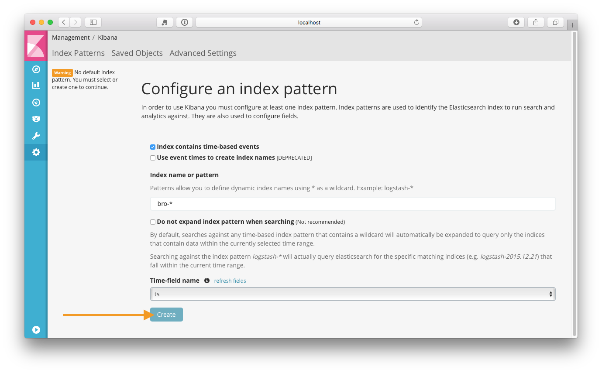
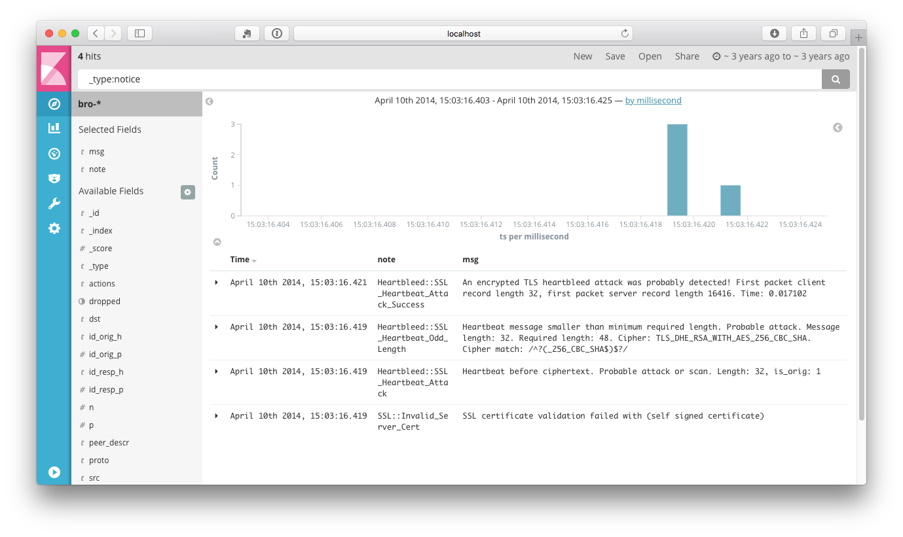

Integrate with the Elastic Stack
--------------------------------

```bash
$ wget https://github.com/blacktop/docker-bro/raw/master/pcap/heartbleed.pcap
$ docker run -d --name elstack -p 80:80 -p 9200:9200 blacktop/elastic-stack
$ docker run -it --rm -v `pwd`:/pcap --link elstack:elasticsearch \
             blacktop/bro:elastic -r heartbleed.pcap local "Site::local_nets += { 192.168.11.0/24 }"

# assuming you are using Docker For Mac.             
$ open http://localhost/app/kibana  
```

> :warning: **NOTE:** I have noticed when running [elastic-stack](https://github.com/blacktop/docker-elastic-stack) on a **linux** host you need to increase the memory map areas with the following [command](https://www.elastic.co/guide/en/elasticsearch/reference/current/docker.html#docker-cli-run-prod-mode)

```bash
echo "vm.max_map_count=262144" | sudo tee -a /etc/sysctl.conf
sudo sysctl -w vm.max_map_count=262144
```

<!-- Configure the Bro index pattern

 -->

Click the [Discover](http://localhost/app/kibana#/discover) tab and filter to `_type:notice`

> Shortcut: [https://goo.gl/4Sh9UP](https://goo.gl/4Sh9UP)



### Watch a folder

```bash
$ docker run -d --name elstack -p 80:80 -p 9200:9200 blacktop/elastic-stack
$ docker run -it --rm -v `pwd`:/pcap --link elstack:elasticsearch blacktop/bro:elastic bro-watch

# assuming you are using Docker For Mac.             
$ open http://localhost/app/kibana

# download pcap into the watched folder on your host.  
$ wget https://github.com/blacktop/docker-bro/raw/master/pcap/heartbleed.pcap
```
